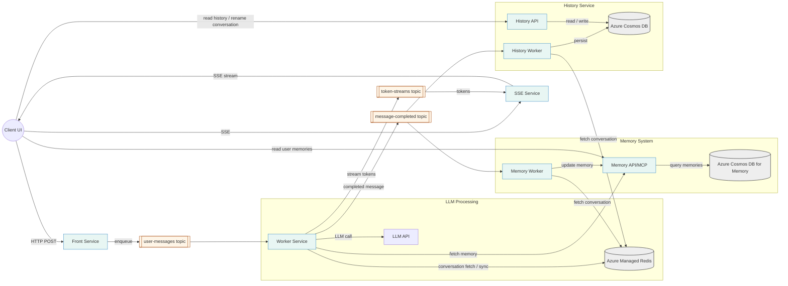
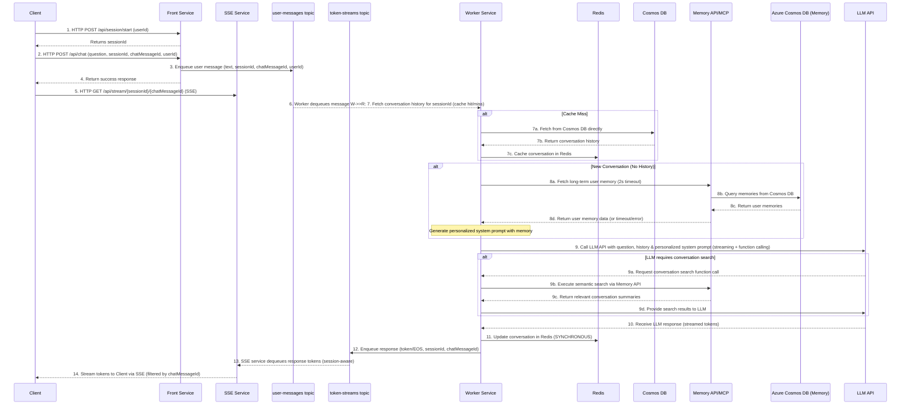
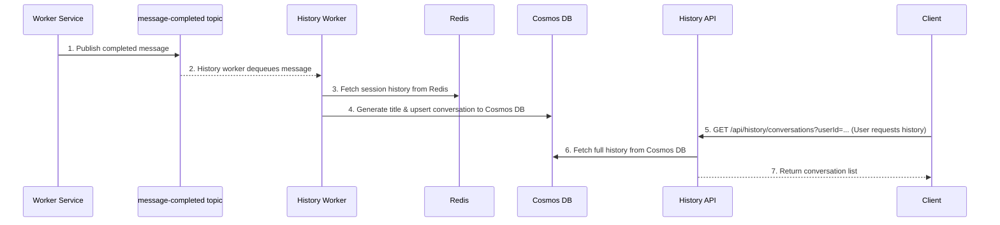
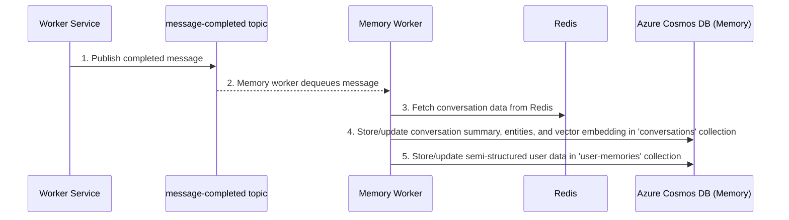
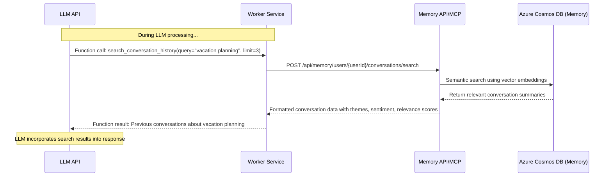

# Architecture of scalable AI chat

**Table of Contents**
- [Architecture of scalable AI chat](#architecture-of-scalable-ai-chat)
  - [Overview](#overview)
    - [1. Architecture overview](#1-architecture-overview)
    - [2. Request / response walkthrough](#2-request--response-walkthrough)
    - [3. History System - Asynchronous Persistence](#3-history-system---asynchronous-persistence)
    - [4. Memory System - Asynchronous Consolidation](#4-memory-system---asynchronous-consolidation)
  - [User Management and Authentication](#user-management-and-authentication)
  - [Conversational history architecture](#conversational-history-architecture)
    - [Data Consistency Model](#data-consistency-model)
    - [Conversational History Data Structures](#conversational-history-data-structures)
  - [Memory Architecture](#memory-architecture)
    - [Memory Components:](#memory-components)
    - [Memory Data Structures](#memory-data-structures)
  - [API Reference](#api-reference)
    - [Front Service APIs](#front-service-apis)
    - [History APIs](#history-apis)
    - [Memory APIs](#memory-apis)
    - [5. Function Calling and Dynamic Conversation Search](#5-function-calling-and-dynamic-conversation-search)

## Overview  
This architecture enables a scalable, reliable, and secure chat application using **Server-Sent Events (SSE)** for real-time streaming responses and **asynchronous worker processes** for heavy lifting. The design decouples the user-facing front-end from the back-end computational work via a message queue, allowing each component to scale and fail independently without disrupting the whole system.

**Key components:**  
- **Client Application (Browser/App):** Sends user questions to the front service and connects to the SSE service for streaming responses via Server-Sent Events. Maintains a session ID to identify the conversation thread and user ID for authentication. Can also retrieve conversation history from History API and user memories from Memory API/MCP for display purposes.
- **Front Service (Message Handler):** A lightweight service that accepts client questions over HTTP, manages sessions, and provides conversation history API. It queues messages for processing but does not handle streaming responses directly. Handles user authentication and session management.  
- **SSE Service (Streaming Service):** A dedicated service that handles Server-Sent Events connections and streams tokens back to clients. This service can be scaled independently based on streaming demand.  
- **Message Queue Service:** A persistent FIFO queue (with partitions or sessions by conversation ID) that brokers requests and responses between services. Includes multiple topics: `user-messages`, `token-streams`, and `message-completed`.  
- **Worker Service (Async Workers):** A pool of one or more back-end worker processes that consume tasks from the queue. Each worker retrieves conversation history from Redis and, for new conversations, fetches long-term user memory from the Memory API to personalize the system prompt. The worker calls the LLM API with context-aware prompts **and function calling capabilities**, enabling the LLM to dynamically search previous conversations via semantic search. The worker synchronously updates Redis with new messages for immediate consistency and publishes completed conversations for memory processing and long-term storage. Memory API calls have a 2-second timeout to ensure system reliability - if memory is unavailable, the worker continues with a basic system prompt.  
- **Azure Managed Redis (Hot Cache):** Fast lookup storage for active conversation history with 24-hour TTL. Workers write directly to Redis synchronously to ensure immediate consistency for ongoing conversations. Optimized for LLM worker performance with dual indexing strategy.  
- **Azure Cosmos DB (Long-term Store):** Persistent storage for conversation history with configurable retention. Provides multi-region capabilities and serves as the authoritative source for historical conversations beyond the Redis cache window. Also used for storing and querying long-term user memories.
- **History Worker:** Listens to `message-completed` events and **persists** conversations to Cosmos DB, generates titles.
- **History API:** Stateless REST service that **serves history to the web client** (`GET /conversations`, `GET /messages`, `PUT /title`). Reads recent data from Redis, full history from Cosmos DB.
- **Memory Worker:** Listens to `message-completed` events and processes completed conversations to extract and store long-term user memories. Directly updates Cosmos DB with conversation summaries and user memory updates.  
- **Memory API:** Stateless REST service that **serves user memories and conversation search to clients and the LLM Worker**. Provides REST endpoints for retrieving user memories (`GET /users/{id}/memories`) and searching conversation memories (`POST /users/{id}/conversations/search`). Similar to History API, it's a read service that queries Cosmos DB.
- **Long-term Memory Stack:**
  - **Azure Cosmos DB:** Stores conversation summaries with vector embeddings (in a `conversations` collection) and structured user profile data (in a `user-memories` collection). Detailed data structures are described in the Memory Architecture section.
- **LLM API (e.g., Azure OpenAI Service):** An external service that generates the chat response. Supports streaming output, function calling, and receives both conversation context and long-term user memories. Can dynamically request additional context through conversation search functions.

Below is a pair of diagrams illustrating the system:

### 1. Architecture overview


### 2. Request / response walkthrough


*Figures: High-level architecture (top) and step-by-step data flow (bottom).*

1.  **Client → Front (Session Start):** The client sends an HTTP `POST` request to `/api/session/start`. The Front Service returns a unique `sessionId`.
2.  **Client → Front (Chat Request):** The client sends the user's question, the `sessionId`, user id `userId`, and a client-generated `chatMessageId` to the Front Service via an HTTP `POST` request to `/api/chat`.
3.  **Front → user-messages topic (Request):** The Front Service packages the question (`text`), `sessionId`, `userId` and `chatMessageId` into a message. It places this message onto the `user-messages` topic in Azure Service Bus, using the `sessionId` as the Service Bus message's `session_id` property.
4.  **Front → Client (Success Response):** The Front Service returns a success response to the client, confirming the message has been queued.
5.  **Client → SSE Service (Stream Connection):** The client establishes an SSE connection to the SSE Service via HTTP `GET` request to `/api/stream/{sessionId}/{chatMessageId}` to receive the streaming response.
6.  **user-messages topic → Worker:** A Worker Service instance picks up the message from its subscription on the `user-messages` topic.
7.  **Worker → Redis/Cosmos DB (History fetch):** The worker retrieves the conversation history for the `sessionId`. It first attempts to fetch from Redis (hot cache). If it's a cache miss (7a), it fetches from Cosmos DB (7b) and then caches it in Redis (7c).
8.  **Worker → Memory API/MCP (Memory fetch):** The worker fetches long-term user memory from the Memory API/MCP service. The Memory API/MCP in turn queries Azure Cosmos DB for relevant memories (8a).
9.  **Worker → LLM API:** The worker calls the LLM API, sending the user’s question, retrieved conversation history, and relevant long-term memories. The request is made in a **streaming mode**.
10. **LLM API → Worker (Streaming):** The LLM processes the prompt and streams back the generated answer token by token.
11. **Worker → Redis (Update short-term history):** The worker synchronously saves the new question and the assistant's response to Redis to ensure immediate consistency for the ongoing conversation.
12. **Worker → token-streams topic (Response stream):** As the worker receives tokens from the LLM, it places them onto the `token-streams` topic. Each message contains the `token` (or an `end_of_stream` signal), the original `sessionId`, and `chatMessageId`.
13. **token-streams topic → SSE Service (Response):** The SSE Service, listening to its subscription on the `token-streams` topic (session-aware, using `sessionId`), dequeues the response tokens.
14. **SSE Service → Client (SSE Stream):** The SSE Service streams the tokens to the correct client via the SSE connection. It uses the `chatMessageId` to ensure tokens are routed to the correct message response stream on the client side.

After the main user flow is complete, the Worker service also publishes a `message-completed` event. This event triggers asynchronous processing for long-term history persistence and memory consolidation, detailed in the following sections.

### 3. History System - Asynchronous Persistence
This diagram illustrates how conversation history is persisted long-term after a chat interaction is completed.

1.  **Worker → message-completed topic:** After successfully processing a user message and streaming the response, the Worker service publishes a message to the `message-completed` topic. This message typically contains identifiers like `sessionId` and `userId`.
2.  **message-completed topic → History Worker:** The History Worker, subscribed to the `message-completed` topic, dequeues the message.
3.  **History Worker → Redis (Fetch Session Data):** The History Worker fetches the complete conversation session data from Redis using the `sessionId`.
4.  **History Worker → Cosmos DB (Persist Long-Term):** The History Worker processes the retrieved session data (e.g., generates a conversation title if not already present) and then persists the full conversation into Azure Cosmos DB for long-term storage.
5.  **Client → History API (Request History):** At a later time, the client can request conversation history via the History API (e.g., `GET /api/history/conversations?userId=...`).
6.  **History API → Cosmos DB (Full History):** The History API queries Cosmos DB directly to retrieve the comprehensive conversation history for the user.
7.  **History API → Client (Return History):** The History API returns the list of conversations to the client.

### 4. Memory System - Asynchronous Consolidation
This diagram shows how long-term memories are extracted and stored after a chat interaction.

1.  **Worker → message-completed topic:** Similar to the history system, the Worker service publishes a message to the `message-completed` topic upon completing a chat interaction.
2.  **message-completed topic → Memory Worker:** The Memory Worker, also subscribed to the `message-completed` topic, dequeues the message.
3.  **Memory Worker → Redis (Fetch Conversation Data):** The Memory Worker fetches the complete conversation session data from Redis using the `sessionId`.
4.  **Memory Worker → Cosmos DB (Store Conversation Memory):** The Memory Worker directly stores conversation summaries, entities, and vector embeddings in the 'conversations' collection of Cosmos DB.
5.  **Memory Worker → Cosmos DB (Update User Memory):** The Memory Worker directly updates semi-structured user profile data in the 'user-memories' collection of Cosmos DB.

*Note: We use `sessionId` as the Service Bus session key for all chat-related messages. This allows the SSE service to open a session receiver for a specific session and only receive messages for that session, without filtering or processing unrelated messages. This approach enables stateless, horizontally scalable services, as any SSE service instance can handle any session. The `chatMessageId` is used to correlate individual questions and responses within a session, especially when a user sends multiple questions in the same session. The front service is lightweight and only handles message queuing, while the SSE service handles all streaming concerns. The worker service writes to Redis synchronously for immediate consistency and publishes to the message-completed topic for asynchronous long-term persistence and memory processing. This design achieves both scalability and simplicity through clear separation of concerns.*

## User Management and Authentication

**User Identity Management:** The system implements a user-centric design where each user has a unique `userId` that persists across sessions. In the initial implementation, we will use hardcoded users for development:

```json
{
  "users": [
    {"userId": "user_001", "name": "Alice Johnson", "email": "alice@example.com"},
    {"userId": "user_002", "name": "Bob Smith", "email": "bob@example.com"},
    {"userId": "user_003", "name": "Carol White", "email": "carol@example.com"}
  ]
}
```

**Future Authentication:** The system is designed to integrate with **Azure Entra ID (formerly Azure AD) via OIDC** for production use. The front service will validate JWT tokens and extract the user identity, mapping to our internal `userId` system. Session management will tie sessions to authenticated users, ensuring proper authorization and data isolation.

**Session-User Relationship:** Each session is associated with a specific user. When a client starts a session via `/api/session/start`, they must provide their `userId`. The front service validates the user exists and creates a session tied to that user. This enables:
- Proper conversation history retrieval for the UI
- User-specific memory and personalization
- Security isolation between users
- Audit trails and usage analytics per user

## Conversational history architecture

The system implements a **hierarchical storage approach** that balances performance and cost:

- **Redis (Hot Cache):** 24-hour TTL for active conversations, optimized for worker performance  
- **Cosmos DB (Long-term Store):** Persistent storage with configurable retention, multi-region capabilities

### Data Consistency Model

**Synchronous Redis Updates:** Workers write conversation updates directly to Redis immediately after LLM responses to ensure consistency for ongoing conversations.

**Asynchronous Cosmos DB Persistence:** Completed conversations are persisted to Cosmos DB via the History Service through the message-completed topic, where eventual consistency is acceptable for historical data.

### Conversational History Data Structures

The system stores conversation data in a hierarchical approach using Redis for short-term storage and Cosmos DB for long-term persistence:

#### Short-term Storage (Redis)
- **Purpose:** Fast lookup storage for active conversations with 24-hour TTL, optimized for LLM worker performance.
- **Key Pattern:** `session:{sessionId}`
- **TTL:** 24 hours
- **Structure:** Each Redis entry contains:
  - `sessionId`: Unique identifier for the conversation session
  - `userId`: ID of the user who owns this conversation (used for authorization and data isolation)
  - `createdAt`: ISO 8601 timestamp when the conversation was first created
  - `lastActivity`: ISO 8601 timestamp of the most recent message in the conversation
  - `title`: Human-readable title for the conversation (initially null, generated by History Worker)
  - `messages`: Array of message objects in chronological order, where each message contains:
    - `messageId`: Unique identifier for the individual message (format: `{chatMessageId}_{role}`)
    - `role`: Either "system", "user", or "assistant" indicating message type
    - `content`: The actual text content of the message
    - `timestamp`: ISO 8601 timestamp when the message was created

#### Long-term Storage (Cosmos DB)
- **Purpose:** Persistent storage for conversation history with configurable retention and multi-region capabilities.
- **Collection:** Configured by `COSMOS_CONTAINER_NAME` environment variable
- **Partition Key:** `userId`
- **Document ID:** `sessionId`
- **Structure:** Each document contains all Redis fields plus additional persistence metadata:
  - `id`: Document identifier (matches `sessionId`)
  - `sessionId`: Unique identifier for the conversation session
  - `userId`: ID of the user who owns this conversation (partition key)
  - `title`: Human-readable title generated by LLM based on conversation content
  - `createdAt`: ISO 8601 timestamp when the conversation was first created
  - `lastActivity`: ISO 8601 timestamp of the most recent message in the conversation
  - `messages`: Array of message objects (same structure as Redis)
  - `persistedAt`: ISO 8601 timestamp when the conversation was persisted to Cosmos DB

## Memory Architecture
**Memory API/MCP Integration:** The system integrates a Memory API/MCP service for sophisticated user memory management, enabling personalized experiences across conversations:

LLM Worker accesses Memory API/MCP via HTTP REST API to retrieve relevant user memories during LLM processing for new conversations only. 
**Memory Worker** is triggered by the `message-completed` topic to extract and store long-term memories by calling Memory API/MCP.
**Client UI** can request user memories via REST API endpoints exposed by Memory API/MCP for display purposes.

**System Prompt Personalization:** The system uses a Jinja2 template-based approach for generating personalized system prompts:
- **Template Location:** `system_prompt.j2` contains the base system prompt with placeholders for user memory
- **Memory Integration:** For new conversations (no existing history), the Worker fetches user memory from Memory API with a 2-second timeout
- **Fallback Strategy:** If Memory API is unavailable or times out, the system continues with a basic system prompt to ensure reliability
- **Template Rendering:** User memory data is injected into the template to create personalized context including preferences, interests, knowledge areas, and communication style
- **Conversation Persistence:** The personalized system prompt is stored as the first message in Redis for conversation continuity

### Memory Components:
- **Memory API/MCP:** Central service providing dual interfaces:
  - **MCP Interface:** Used by Worker Service to retrieve memories during LLM processing
  - **REST API:** Used by Client UI to display memories to users
- **Azure Cosmos DB:** Primary storage for all memory data, including conversation summaries with embeddings and structured user profiles.
- **Memory Worker:** Processes completed conversations to extract and update memories in Azure Cosmos DB via the Memory API/MCP.

### Memory Data Structures
The long-term memory is stored in Azure Cosmos DB using two main collections:

-   **`conversations` collection:**
    -   **Purpose:** Stores summaries of each conversation for semantic retrieval and context.
    -   **Structure:** Each document in this collection represents a summarized conversation and contains:
        -   `userId`: The ID of the user who participated in the conversation.
        -   `sessionId`: The ID of the original conversation.
        -   `summary`: A single paragraph of text generated by an LLM, summarizing the conversation.
        -   `timestamp`: The time the summary was created or last updated.
        -   `themes`: A list of key themes or topics discussed in the conversation.
        -   `persons`: A list of named individuals mentioned.
        -   `places`: A list of locations mentioned.
        -   `user_sentiment`: An indicator of the user's overall sentiment during the conversation (e.g., positive, neutral, negative).
        -   `vector_embedding`: An embedding vector used for semantic similarity searches.

-   **`user-memories` collection:**
    -   **Purpose:** Stores semi-structured JSON data representing what the system has learned about the user over time.
    -   **Structure:** Each document is keyed by `userId` and contains various attributes that are regularly updated by the Memory Worker using an LLM. These attributes include:
        -   `output_preferences`: User's preferred output styles, such as desired length, level of detail, and format.
        -   `personal_preferences`: How the user prefers to be addressed (e.g., name, pronouns) and general tone of interaction.
        -   `assistant_preferences`: User's preferences for the assistant's persona, such as name, communication style, or even perceived gender if expressed.
        -   `knowledge`: Topics or areas where the user has demonstrated deep understanding.
        -   `interests`: Subjects, hobbies, or areas the user enjoys or has expressed a desire to learn more about.
        -   `dislikes`: Topics, items, or interaction styles the user has indicated they do not like.
        -   `family_and_friends`: Information the user has voluntarily shared about their personal connections.
        -   `work_profile`: Details shared by the user about their profession, tasks, or work-related context.
        -   `goals`: Long-term personal or professional objectives the user has mentioned.

## API Reference

This section provides a comprehensive reference for all REST APIs in the scalable chat system. Each service exposes specific endpoints for different aspects of the chat functionality.

### Front Service APIs
The Front Service provides session management and message queuing functionality. These are the primary endpoints that client applications interact with to initiate conversations.

| Method | Endpoint | Description |
|--------|----------|-------------|
| `POST` | `/api/session/start` | Start a new conversation session for a user |
| `POST` | `/api/chat` | Send a chat message to be processed by the system |

### History APIs  
History APIs provide access to conversation history and allow users to update conversation titles. They are designed to be stateless and can scale independently of the front service.

| Method | Endpoint | Description |
|--------|----------|-------------|
| `GET` | `/api/history/users/{userId}/conversations` | Retrieve all conversations for a specific user |
| `GET` | `/api/history/conversations/{sessionId}` | Retrieve a specific conversation by session ID |
| `PUT` | `/api/history/conversations/{sessionId}/title` | Update the title of a specific conversation |

### Memory APIs
Memory API/MCP provides dual interfaces for memory management:

**REST API endpoints (for Client UI):**

| Method | Endpoint | Description |
|--------|----------|-------------|
| `GET` | `/api/memory/users/{userId}/memories` | Retrieve structured memories for a specific user |
| `DELETE` | `/api/memory/users/{userId}/memories` | Delete memories for a specific user |
| `POST` | `/api/memory/users/{userId}/conversations/search` | Search conversational memories for a specific user via semantic search |

**MCP Interface (for Worker Service):**
The same as the REST API, but uses a different protocol for communication.

**Function Calling Interface (for LLM Worker):**
- The `/api/memory/users/{userId}/conversations/search` endpoint is also used by the Worker Service to execute the `search_conversation_history` function when called by the LLM during processing
- Enables dynamic conversation search based on semantic similarity rather than keyword matching
- Returns conversation summaries with themes, sentiment analysis, relevance scores, and metadata

### 5. Function Calling and Dynamic Conversation Search
The Worker Service implements advanced **function calling capabilities** that enable the LLM to dynamically access user's conversation history during processing. This provides contextual awareness that goes beyond the current conversation session.



**Function Calling Features:**
- **Semantic Search**: Uses vector embeddings to find relevant conversations by meaning, not just keywords
- **Contextual Integration**: Results are automatically incorporated into the LLM's response generation
- **Streaming Compatible**: Function calls work seamlessly with streaming token delivery
- **Intelligent Triggering**: LLM autonomously decides when conversation search would be helpful

**Available Functions:**
- `search_conversation_history(search_query, limit)`: Performs semantic search through user's previous conversations, returning summaries with themes, sentiment analysis, and relevance scores

*This capability transforms the chat experience from session-isolated interactions to a truly contextual, memory-aware conversation system.*

