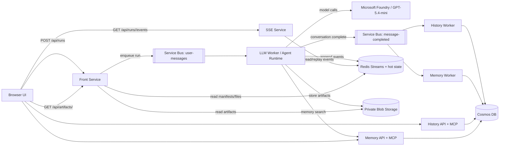
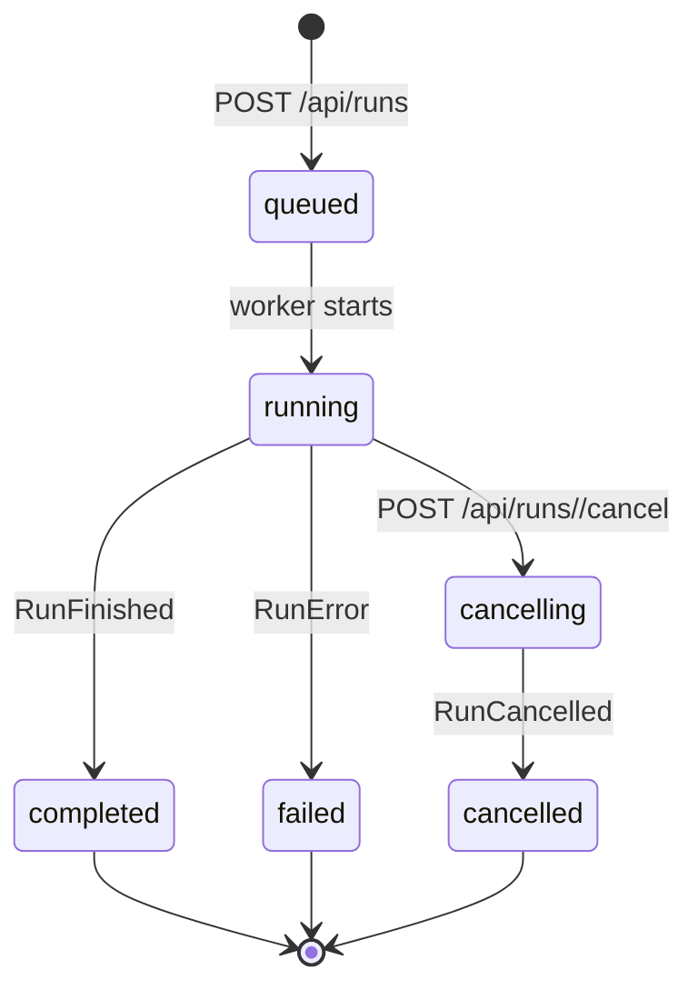
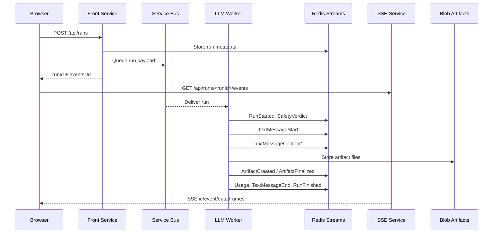

# Architecture

The goal is to show a scalable AI chat system without hiding the distributed-systems parts behind a monolith. A user message becomes a durable run. The stream is only a live view over ordered run events, so refreshes, reconnects, cancellation, post-processing, and observability all have durable state to work with.

## Core decisions

| Decision | Why it matters |
| --- | --- |
| Use a durable `run` resource | A chat turn can be queued, running, completed, failed, or cancelled independently of any browser connection. |
| Use SSE over HTTP for browser streaming | It is simple, browser-native, proxy-friendly, and supports replay with event IDs. |
| Store hot run events in Redis Streams | Streams are ordered, replayable, fast, and a better last-mile event log than a queue subscription. |
| Keep Service Bus for durable work | Service Bus is the durable backbone for user input and post-run fan-out, not token delivery. |
| Use Cosmos DB for long-term state | History and memory need queryable durable storage; memory also needs vector search. |
| Use Blob Storage for artifacts | Generated widgets and micro-app bundles are files; private Blob Storage gives durable, scalable storage. |
| Use managed identities | Services authenticate to Azure resources without application secrets. |
| Use Terraform and GitHub Actions | The demo is repeatable: infrastructure, RBAC, and image builds are all automated. |

## Component view

```mermaid
flowchart LR
    Browser[Browser UI] -->|POST /api/runs| Front[Front Service]
    Browser -->|"GET /api/runs/<runId>/events"| Stream[SSE Service]
    Browser -->|"GET /api/artifacts/<artifactId>"| Front

    Front -->|enqueue run| UserMessages[[Service Bus: user-messages]]
    UserMessages --> Worker[LLM Worker / Agent Runtime]

    Worker -->|model calls| Foundry[Microsoft Foundry / GPT-5.4-mini]
    Worker -->|memory search| MemoryAPI[Memory API + MCP]
    Worker -->|append events| Redis[(Redis Streams + hot state)]
    Worker -->|store artifacts| Blob[(Private Blob Storage)]
    Worker -->|conversation complete| Completed[[Service Bus: message-completed]]

    Stream -->|read/replay events| Redis
    Front -->|read manifests/files| Redis
    Front -->|read artifacts| Blob

    Completed --> HistoryWorker[History Worker]
    Completed --> MemoryWorker[Memory Worker]
    HistoryWorker --> Cosmos[(Cosmos DB)]
    MemoryWorker --> Cosmos
    HistoryAPI[History API + MCP] --> Cosmos
    MemoryAPI --> Cosmos

    Browser --> HistoryAPI
    Browser --> MemoryAPI
```

## Run lifecycle

```mermaid
stateDiagram-v2
    [*] --> queued: POST /api/runs
    queued --> running: worker starts
    running --> completed: RunFinished
    running --> failed: RunError
    running --> cancelling: POST /api/runs/<runId>/cancel
    cancelling --> cancelled: RunCancelled
    completed --> [*]
    failed --> [*]
    cancelled --> [*]
```

The worker checks cancellation before model calls, during token streaming, before tools, and before artifact generation. Closing the browser stream does not cancel the run.

## Event flow

```mermaid
sequenceDiagram
    participant B as Browser
    participant F as Front Service
    participant SB as Service Bus
    participant W as LLM Worker
    participant R as Redis Streams
    participant S as SSE Service
    participant A as Blob Artifacts

    B->>F: POST /api/runs
    F->>R: Store run metadata
    F->>SB: Queue run payload
    F-->>B: runId + eventsUrl
    B->>S: GET /api/runs/<runId>/events
    SB-->>W: Deliver run
    W->>R: RunStarted, SafetyVerdict
    W->>R: TextMessageStart
    W->>R: TextMessageContent*
    W->>A: Store artifact files
    W->>R: ArtifactCreated / ArtifactFinalized
    W->>R: Usage, TextMessageEnd, RunFinished
    S-->>B: SSE id/event/data frames
```

Every event has a monotonic `sequence`. The SSE `id` equals that sequence. A reconnect with `Last-Event-ID: 42` receives event 43 onward.

## Data ownership

| Data | Owner | Hot store | Durable store |
| --- | --- | --- | --- |
| Run metadata | Front Service + LLM Worker | Redis | Run summary in Cosmos-ready shape |
| Run events | LLM Worker | Redis Stream | Terminal summary and artifacts |
| Conversation history | LLM Worker + History Worker | Redis | Cosmos DB |
| Memory summaries | Memory Worker | n/a | Cosmos DB with vector index |
| Artifact manifests | LLM Worker | Redis | Blob path + manifest; API returns both |
| Artifact files | LLM Worker | n/a | Private Blob Storage |

## User interfaces

The main demo UI is `src/web_client`. It creates runs, streams events, renders text, usage, cancellation, table/chart artifacts, and sandboxed micro-app artifacts.

`src/agent_client` is a small CopilotKit/Next.js scaffold that proves how the run/event API maps to an AG-UI-oriented frontend stack. It is separate from the demo UI so the runtime architecture stays clear.
