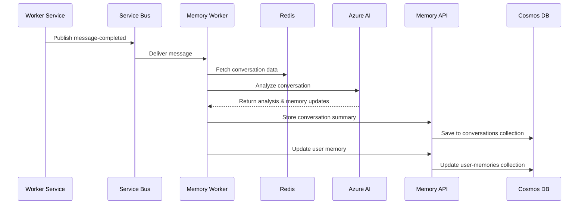

# Scalable Chat Memory Worker Service

This worker service listens to the `message-completed` Azure Service Bus topic and processes conversation data to extract and store long-term user memories in Azure Cosmos DB via the Memory API.

## Message Handling

1. **Receiving Message-Completed Events**:
   - The worker picks up messages from its subscription on the `message-completed` topic.

2. **Processing Messages**:
   - The worker fetches the complete conversation data from Redis using the `sessionId`.
   - Uses LLM to analyze the conversation and extract key information.
   - Stores conversation summary with metadata in Cosmos DB via Memory API.
   - Updates user memory profile based on new information learned from the conversation.

3. **Memory Storage**:
   - **Conversation Memory**: Stores summarized conversations with themes, entities, and sentiment in the `conversations` collection.
   - **User Memory**: Updates structured user profiles in the `user-memories` collection with new preferences, interests, knowledge, etc.

## Architecture Components

- **Azure Service Bus**: Message-completed topic subscription for event-driven processing
- **Azure Managed Redis**: Source of conversation data (24-hour TTL hot cache)
- **Memory API**: Target service for storing memory data in Cosmos DB
- **Azure AI Inference**: LLM API for conversation analysis and memory extraction
- **Azure Monitor**: Observability and logging

## Memory Extraction Process

The service uses LLM-powered analysis to extract two types of memories:

### 1. Conversation Summary
Extracts structured information about each conversation:
- **Summary**: Concise paragraph summarizing the conversation
- **Themes**: Key topics discussed (max 5)
- **Persons**: Named individuals mentioned (excluding user/assistant)
- **Places**: Specific locations mentioned  
- **User Sentiment**: Overall user sentiment (positive/neutral/negative)

### 2. User Memory Updates
Analyzes conversations to update user profile with new information:
- **Output Preferences**: User's preferred response styles and formats
- **Personal Preferences**: How user prefers to be addressed (name, pronouns, tone)
- **Assistant Preferences**: User's preferences for assistant behavior
- **Knowledge**: Topics where user demonstrates understanding
- **Interests**: User's hobbies, interests, and subjects they enjoy
- **Dislikes**: Topics, styles, or things user explicitly dislikes
- **Family & Friends**: Personal connections user mentions
- **Work Profile**: Professional information user shares
- **Goals**: User's stated objectives or aspirations

## Setup

### Prerequisites

- Python 3.12+
- uv package manager
- Azure Service Bus namespace
- Azure Managed Redis cache
- Azure AI Inference endpoint
- Memory API service running

### Environment Variables

Create a `.env` file with the following variables:

```env
SERVICEBUS_FULLY_QUALIFIED_NAMESPACE=your-servicebus.servicebus.windows.net
SERVICEBUS_MESSAGE_COMPLETED_TOPIC=message-completed
SERVICEBUS_MESSAGE_COMPLETED_SUBSCRIPTION=memory-worker-message-completed
AZURE_AI_CHAT_ENDPOINT=https://your-ai-service.openai.azure.com/openai/deployments/gpt-4
REDIS_HOST=your-redis.redis.azure.net
REDIS_PORT=10000
REDIS_SSL=true
MEMORY_API_ENDPOINT=http://memory-api:8003
LOG_LEVEL=INFO
MAX_CONCURRENCY=10
APPLICATIONINSIGHTS_CONNECTION_STRING=your-app-insights-connection-string
OTEL_SERVICE_NAME=memory-worker
```

### Installation

```bash
# Install dependencies using uv
uv sync

# Run the service
uv run python main.py
```

### Docker

```bash
# Build the Docker image
docker build -t memory-worker .

# Run the container
docker run \
  -e SERVICEBUS_FULLY_QUALIFIED_NAMESPACE=your-servicebus.servicebus.windows.net \
  -e AZURE_AI_CHAT_ENDPOINT=https://your-ai-service.openai.azure.com/openai/deployments/gpt-4 \
  -e REDIS_HOST=your-redis.redis.azure.net \
  -e MEMORY_API_ENDPOINT=http://memory-api:8003 \
  memory-worker
```

## Data Flow



## Error Handling

- **Message Processing Errors**: Messages are abandoned and retried automatically
- **LLM Analysis Failures**: Default values are used for conversation summaries
- **Memory API Failures**: Errors are logged, processing continues
- **Redis Connection Issues**: Service will retry with exponential backoff
- **Graceful Shutdown**: Service handles SIGTERM/SIGINT for clean shutdown

## Monitoring

The service provides comprehensive observability:
- **Azure Monitor**: Distributed tracing and metrics
- **Structured Logging**: JSON formatted logs with correlation IDs
- **Health Checks**: Redis connectivity and LLM availability
- **Performance Metrics**: Message processing times and throughput

## Scaling

The service can be scaled horizontally:
- Multiple instances can process different messages concurrently
- Service Bus provides message distribution across instances
- Each instance maintains its own Redis and LLM connections
- Memory API handles concurrent requests from multiple workers
